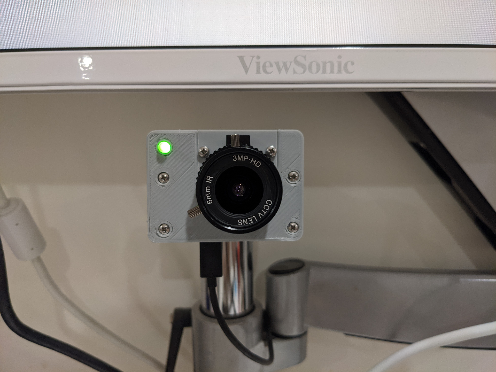
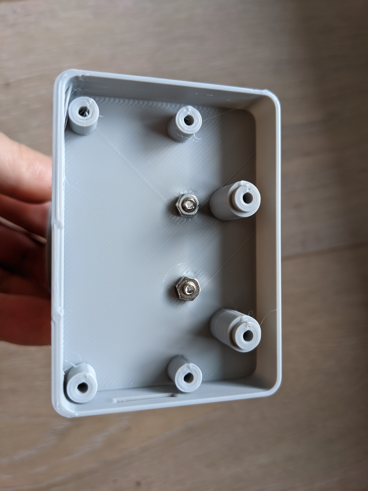

# 3D-printed case for a DIY webcam based on Raspberry Pi Zero and RPi HQ camera 

This is a camera enclosure for an excellent [Showmewebcam](https://github.com/showmewebcam/showmewebcam) project. 

Here is how it looks printed. My z-offset wasn't correct for this print, so if printed correctly the front will look much better :)  

This is the inside view for mounting of the RPi Zero and the camera:

[STLs on Thingiverse](https://www.thingiverse.com/thing:4646780)
